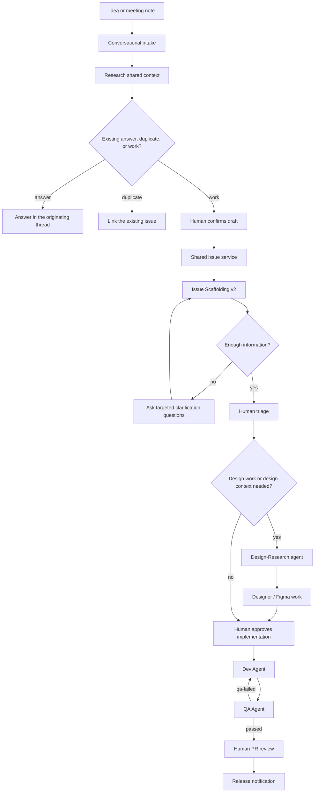

# AI-Native PDLC Blueprint for Modus Web Components

**Target repository:** `trimble-oss/modus-wc-2.0`  
**Design-system context:** the target repository is the shared source of truth.  
**Status:** implementation blueprint; console, n8n, Google Chat, and Figma
changes are human-applied.

## Executive summary

The Modus delivery path should treat issue creation as a clarification and
research step, not as a form-filling step. Product, design, development, QA,
and chat agents all need to consult the same repository artifacts before they
make a capability claim or commit to work.

The proposed path is:



The bot does not create an issue merely because somebody said “we should
change this.” It first checks whether the repository already answers the
question, whether an issue already tracks the work, and whether the remaining
unknowns can be resolved from repository evidence. When they cannot, it asks
specific questions and waits.

## The motivating failure: issue #1466

Issue [#1466](https://github.com/trimble-oss/modus-wc-2.0/issues/1466)
exposed a shared-context failure around read-only states for form controls:

1. The design discussion considered a `select` read-only state without a
   reliable, current inventory of the states already implemented by Modus.
2. The design, product, and engineering participants therefore had different
   assumptions about whether the state was required, new, or already
   supported by a sibling component.
3. The implementation reached a PR before the capability question had been
   made explicit to all decision-makers.

The prevention is not “ask an LLM whether `select` supports read-only.” The
prevention is a cited capability check against
`src/custom-elements.json`, the component documentation, and the Modus
component-docs MCP. The result must distinguish:

- **Already supported:** reuse the existing API and document the relevant
  state.
- **Not supported:** describe the new API surface, affected components, and
  product/design decision required before implementation.
- **Unknown:** stop with `## NEED CLARIFICATION`; do not infer from a
  similarly named component.

The same control applies to requests such as “add XS and XL to textarea,”
“design the monochromatic logo variant,” or “test the tooltip delay PR.”
Those short requests are useful seeds, but they are not implementation-ready
contracts. The live Sprint 09/02 examples
[#1459](https://github.com/trimble-oss/modus-wc-2.0/issues/1459),
[#1462](https://github.com/trimble-oss/modus-wc-2.0/issues/1462), and
[#1468](https://github.com/trimble-oss/modus-wc-2.0/issues/1468) demonstrate
the quality gap: each has a very small body and lacks a complete description,
acceptance criteria, design context, and test plan.

## Shared context contract

The target repository remains the source of truth. No second product database
is introduced for component capabilities.

| Surface | Truth it provides | Consumers |
| --- | --- | --- |
| `src/custom-elements.json` | Current custom-element tags, properties, events, slots, and reflected states | Issue Scaffolding, Design-Research, Q&A bot, designers |
| Component `readme.md` and Storybook stories | Usage, visual examples, migration notes, and behavior details | Issue Scaffolding, Dev, QA, designers |
| `AGENTS.md` | Repository-specific build, branching, and operating instructions | Every Cursor automation |
| `.cursor/rules/*` | API stability, automation routing, code, and QA conventions | Every Cursor automation |
| `mcp/component-docs` | Query interface over component documentation and implementation guides | Chat bots, Cursor agents, Figma workflow |
| `docs/component-graph/component-graph.json` | Direct reverse-impact relationships for changed components | Issue Scaffolding, Dev, QA, Design-Research |
| `custom-elements.md` | Generated human/LLM-readable capability matrix derived from the manifest | Google Chat, Figma plugin, designers, reviewers |
| Drive-staged design artifacts | Approved design source, variants, tokens, and screenshots | Dev and QA through the existing QA-source protocol |
| GitHub issues and PRs | Decisions, acceptance criteria, implementation, review, and audit trail | Humans and all agents |

### Source precedence

When sources disagree, agents use this order:

1. The target branch's `src/custom-elements.json`.
2. The target branch's component source, readme, and Storybook stories.
3. The target branch's Modus MCP response.
4. `AGENTS.md` and applicable `.cursor/rules/*`.
5. The generated `custom-elements.md` for discovery and cross-surface
   readability.
6. Human clarification when the sources are incomplete or contradictory.

`custom-elements.md` is a derived artifact, not an alternative authority. The
generation step must fail or visibly report drift when the source manifest
cannot be read. A new generic `context.md` is not part of the first rollout:
`AGENTS.md`, the capability matrix, component docs, and MCP already have
distinct ownership. Repeated clarification gaps are evidence for adding a
small, deliberately scoped context artifact later.

## Roles, stages, and handshake checkpoints

The process adopts the AI-PDLC language while keeping product ownership and
human gates explicit.

| Stage | Primary role | Agent support | Exit artifact |
| --- | --- | --- | --- |
| Idea prioritization | Product Definer | Q&A and ticket bot research, classify, and deduplicate | Answer, linked issue, or confirmed work draft |
| Sprint planning / estimating | Product Definer + Product Builder | Gemini notes intake classifies every item and shows capacity context | Reviewed list of repo-work and design-work candidates |
| T1 viability / scope | Product Definer + Architect | Issue Scaffolding v2 checks capabilities, blast radius, and missing decisions | Issue with cited context or explicit clarification questions |
| Design handshake | Product Builder + designer | Design-Research checks existing capabilities and design states | Capability check, design source, states, and Figma link |
| T2 build and test | Product Builder | Dev Agent implements on an isolated branch; QA Agent independently verifies | PR with AC, QA-source, graph, and routing evidence |
| Review / launch | Human reviewer / Agent Ops | Release workflow distributes approved notes | Human-approved merge and release communication |

Every handshake has an owner, an artifact, and an exit criterion:

- **Scope:** Product owns the intended outcome; the issue has a problem,
  affected component, user-visible behavior, and open questions.
- **Capability:** Design-Research owns the repository comparison; every
  capability claim cites the manifest or MCP.
- **Design:** Design owns the source of truth for new visual decisions; the
  staged Drive artifact identifies the variant and states.
- **Build:** Dev owns code and tests; the PR checks off each AC and includes
  the required QA routing block.
- **Verification:** QA owns independent evidence; green npm commands alone
  are never a visual verdict.
- **Release:** Humans own the merge/release decision.

## Intake paths

All intake paths converge on the same issue service and Issue Scaffolding v2.
They differ only in how the initial evidence is captured.

### Cursor Docs Review pilot path

For the meeting-intake pilot, Gmail/Calendar evidence is classified by a
Cursor skill and written to a Google Docs `ReviewItems` ledger. Apps Script
polls explicit reviewer commands such as `@cursor-review`, `approve`, and
`changes-requested`, claims each round under a script lock, and invokes the
next Cursor review round. Approved eligible rows go through the shared Issue
Service; the resulting issue number and URL are written to the same
document's `Issues` section.

This path replaces Google Chat cards and n8n orchestration for the pilot. It
does not remove human approval, duplicate search, evidence citations,
idempotency, or failure recovery. Existing n8n workflows remain migration
fallbacks until dry-run and parity checks pass. See
[`docs/chat-bots/cursor-docs-review-workflow.md`](chat-bots/cursor-docs-review-workflow.md).

### Conversational ticket bot

The Google Chat app handles a tagged thought, a thread, or a structured
meeting handoff:

1. Read the relevant thread window and identify the problem, component, and
   expected outcome.
2. Search the repository context and open GitHub issues.
3. Ask only the questions that remain unanswered.
4. Decide whether the response is an answer, duplicate, or actual work.
5. Show a draft for human confirmation.
6. Call the shared issue service only after confirmation.

The state is keyed by Chat space and thread. It expires after a configured
period and has explicit `stop` and `discard` paths. See
[`docs/chat-bots/ticket-bot.md`](chat-bots/ticket-bot.md).

### Q&A bot

The Q&A bot is answer-first. It gathers the recent conversation, queries the
same sources, cites the relevant repository links, and answers in-thread. If
the answer demonstrates a real missing capability or an actionable defect, it
offers an “Open a draft issue” action. The user must confirm; the bot never
turns every question into a ticket. See
[`docs/chat-bots/qa-bot.md`](chat-bots/qa-bot.md).

### Gemini meeting-notes intake

Gemini notes are convenient input, not authority. The intake workflow:

- accepts only `Sprint Planning` and `Sprint Estimating` subjects;
- verifies the event's recurring-series ID against a configured Modus
  allowlist;
- uses the linked Google Doc as the completeness source;
- keys idempotency on the notes Doc ID;
- classifies every extracted item into exactly one of
  `repo-work`, `design-work`, `process/meta`, `decision-record`, or
  `already-tracked`;
- displays every item in a review card, including items that will not become
  issues;
- sends only human-selected repo-work and design-work items to the shared
  issue service.

The classification rubric is versioned in
[`docs/chat-bots/meeting-intake-rubric.md`](chat-bots/meeting-intake-rubric.md).

### Backlog and sprint-sheet enrichment

GitHub becomes the actionable source of truth; the Google Sheet remains the
planning and estimation view. The enrichment workflow:

- reads the `Modus Backlog` ready and in-refinement sections;
- checks issue-numbered rows for scaffolding completeness;
- creates or backfills issues for unnumbered rows after duplicate search;
- writes the issue number back to the same row;
- resolves the current `Sprint MM/DD` tab by date rather than hardcoding a
  gid;
- runs a pre-sprint readiness check for rows entering the next sprint;
- attaches Team-tab remaining-capacity values read-only to the review card;
- reports missing priority, size, or design source instead of inventing them.

Paired design/development rows for one feature are linked in both issues by
the Design-Research step.

## Issue Scaffolding v2

Issue Scaffolding is a research-and-contract stage, not a markdown formatter.
It applies to chat, meeting, sheet, and human-created issues.

### Research sequence

For each candidate issue, it gathers:

1. **Intake context** — webhook `additional_context` (sheet review fields,
   meeting metadata, acceptance criteria, reviewer comments) when present.
2. **Meeting notes** — Google Doc linked by `source.meetingDocId` or `source.url`;
   extract the item excerpt that matches title/sourceExcerpt.
3. The component entry and properties in `custom-elements.json`.
4. The relevant `get_modus_component_data` MCP response.
5. The component readme, Storybook stories, and sibling-component precedent.
6. `AGENTS.md`, applicable rules, and the component graph's direct
   `reverseImpact`.
7. Existing open and closed issues/PRs for duplicates and prior decisions.
8. **Modus blueprint** — `trimble-oss/modus-blueprint`
   `public/modus-llm/components/<kebab-name>/` for patterns, states, and tokens.
9. **Figma-staged design** — staged Drive folder (`manifest.json`, then only the
   matching variant's `variable-defs.json` and `design-context.md`); cloud agents
   do not use live Figma MCP.
10. A design source link or an explicit `design needed` result when none of the
    above supply visual spec.

The agent records source links and distinguishes observed facts from
questions. It never fabricates a prop, token, state, target size, or affected
product.

### Required dual-audience output

Every completed scaffold contains:

- **Context:** current behavior and cited repository evidence.
- **Problem / user outcome:** who needs what and why.
- **Proposed change:** intended behavior and API impact.
- **Acceptance Criteria:** happy paths and rainy/error/empty/loading paths.
- **Design notes:** states, tokens, existing design source, or `design needed`.
- **Technical notes:** likely files, sibling precedent, graph impact, and
  compatibility constraints.
- **Test plan:** unit, Storybook, accessibility, and visual evidence as
  applicable.
- **Source links:** manifest/MCP/readme/issue/Figma/meeting references.

### Gap behavior

If required information is still missing after repository research, the agent
comments on the correct surface:

```text
## NEED CLARIFICATION
- [specific question with enough context for a decision]
- [one question per line]
```

It adds `needs-human`, does not open a PR, and waits. Chat-born questions are
relayed to the originating thread; sheet-born questions appear on the review
card. The scaffold resumes when the human answers. If the request conflicts
with API stability or cannot be safely implemented in the stated scope, it
uses the existing `## NOT FEASIBLE` convention instead.

## Design-Research and designer enablement

The `design-research` label or `/design` comment invokes a capability check
before design work is treated as an implementation contract. The agent:

- checks whether the requested component/state already exists;
- identifies reusable sibling patterns;
- lists the states that the design must specify;
- identifies API and compatibility consequences;
- reads the component graph for direct impact;
- asks for a staged Drive design source when the live Figma link cannot be
  consumed by cloud QA;
- comments with citations and a routing outcome.

Designers receive the same information through:

- generated `custom-elements.md`;
- the Figma capability-search plugin scaffold;
- portable `design-capability-check` and `design-to-issue` skills;
- a before-design checklist that explicitly covers existing API, states,
  tokens, accessibility, responsive behavior, and design-source handoff.

The plugin is an assistive search and mismatch detector. It does not approve
new API, replace product decisions, or write GitHub issues without the shared
issue service and human confirmation.

## Existing Dev and QA loop

The blueprint aligns with the verified live console behavior:

- Dev Agent handles `/approve`, `/ask`, `/clarify`, `/refine`, and repair
  triggered by `qa-failed`. The inactive Fix Agent is not re-enabled.
- QA Agent runs independently from `qa-full`, `qa-rerun`, and `qa-skip` labels.
  A PR-opened trigger is not part of the canonical setup.
- QA gates, tests, visual evidence, and coverage are reported as separate
  dimensions. A passing npm command is not a visual verdict.
- Drive-staged Figma artifacts use `manifest.json` first, then only the
  matching variant files. Cloud agents do not use live Figma MCP.
- Dev and QA read `docs/component-graph/component-graph.json` and use the
  direct `reverseImpact` entry for changed tags.
- Agents write routing signals in PR conversation comments. A GitHub Action
  attaches labels; agents do not create labels.
- Dev and QA use `## NEED CLARIFICATION`, `## NOT FEASIBLE`, and the six QA
  verdict headers documented in `harness/AUTOMATION-PROMPTS.md`.

## Trimble AI-PDLC alignment

This implementation covers the Modus-scale T2 engineering loop and the
product-to-engineering delivery loop. It does not replace the human-led T0
GEMs or organization-wide Materiality, Invest, and Launch gates.

| Playbook concept | Modus implementation |
| --- | --- |
| Product Definer / Product Builder / Architect / Agent Ops | Human product/design owners, Dev/QA agents, and automation maintainers |
| Idea prioritization and PI/Sprint Planning | Conversational ticket bot plus filtered Gemini-notes intake |
| Jira as output, not input | GitHub issue is created only after clarification, duplicate search, and confirmation |
| Brownfield / capability discovery | `custom-elements.json`, MCP, component docs, and component graph |
| Ask → Plan → Agent | Q&A/clarification, Issue Scaffolding contract, isolated Dev Agent branch |
| Living PRD / change log | Issue context, decision records, design source, PR body, and review comments |
| Handshake checkpoints | Explicit scope, capability, design, build, QA, and release exit artifacts |
| Figma Make + MCP | Figma plugin/skills use capability data; staged Drive artifacts feed cloud QA |
| T2 design spec | Tokens plus loading, empty, error, success, disabled, and interaction states |

The open gap remains the organization-level discovery and investment
artifacts. This repository should link to them when supplied, but must not
pretend the engineering pipeline produces them.

## Measurement boundary

`design_context` and `chat_intake` are registered as candidate recovery
factors. They are simulation-first and have placeholder weights only:

- they contribute zero recovery activity unless telemetry or an explicit arm
  toggle observes them;
- no live effect or causal claim is made;
- ablation must precede any fitted or standing claim;
- score output must disclose per-field provenance, `weight_source`, and
  `record_kind`.

The implementation will instrument events such as a cited capability check,
clarification round, duplicate decision, and confirmed issue handoff. It will
not infer activity from the existence of a document.

## Human-applied changes and rollout

This repository delivers prompts, sanitized workflow exports, specs, and
scaffolds. A human must:

1. Retarget the Issue Scaffolding automation to
   `trimble-oss/modus-wc-2.0`.
2. Add/save the Design-Research automation and the documented triggers.
3. Import each n8n template, bind Trimble Model Gateway, Google Chat, Gmail,
   Calendar, Drive, GitHub, and webhook credentials, and set the Modus
   calendar-series allowlist.
4. Register the Google Chat app and point its message/interaction endpoint at
   the n8n webhook.
5. Build/publish the Figma plugin after validating the raw GitHub source URL
   and target file permissions.
6. Run a dry run with a known answer, a duplicate, a missing-capability
   request, and a process/meta Gemini note before enabling issue creation.

Suggested rollout gates:

- **Observe:** bot answers and displays classifications without creating issues.
- **Pilot:** human confirms selected items; Issue Scaffolding creates drafts with
  `auto_approve: false`.
- **Measure:** collect intake, clarification, duplicate, scaffold, and
  clarification-gap telemetry.
- **Expand:** enable backlog enrichment and designer plugin after the pilot
  demonstrates that issue quality improved without hidden omissions.

## Follow-up PRs in `modus-wc-2.0`

These changes belong in the target repository, not this research repository:

1. Add a build script that renders `src/custom-elements.json` into
   `custom-elements.md`, with a drift check.
2. Add a `component-capabilities` MCP tool for state/property searches across
   the manifest.
3. Add the `design-research` label and trigger guidance to
   `.cursor/rules/automation.mdc`.
4. Add the Issue Scaffolding v2 prompt and input contract to the official
   automation configuration.
5. Add or maintain the component graph artifact used by Dev and QA.
6. Decide where the Figma plugin is owned and publish the scaffold after the
   capability-matrix contract is stable.

The target repository should accept each as a focused PR with its own tests,
source citations, and human review.
