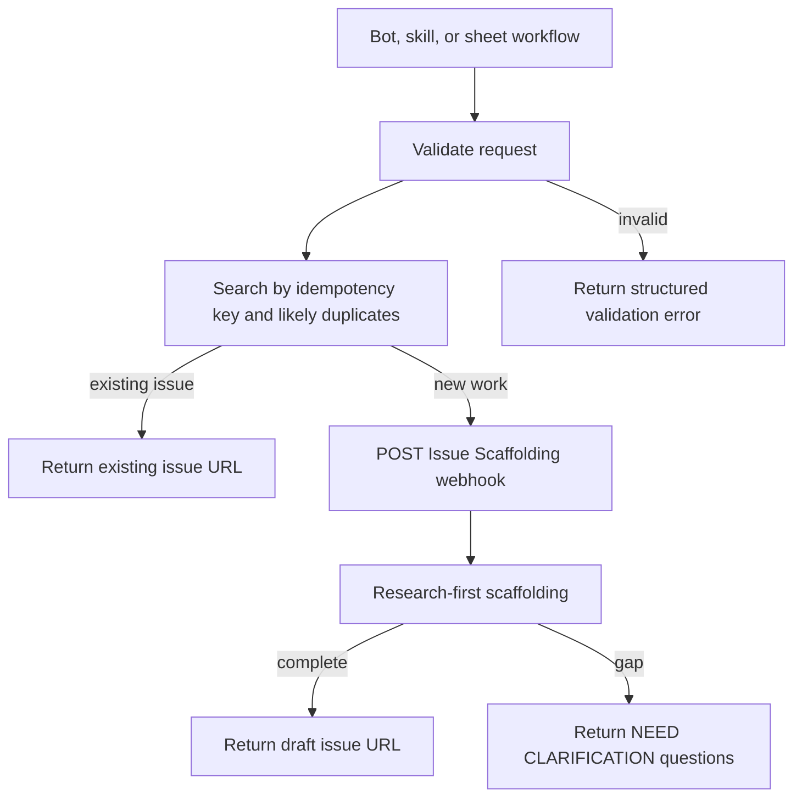

# Shared issue-creation service

The ticket bot, Q&A bot, Gemini meeting intake, backlog enrichment, and future
Cursor skills must use one issue-creation contract. They must not each invent
GitHub issue templates, duplicate checks, or Issue Scaffolding payloads.

The service has two equivalent adapters:

1. an n8n sub-workflow / HTTP endpoint used by Google Chat workflows; and
2. the sanitized standalone [`scripts/issue_service.py`](../../scripts/issue_service.py)
   used by local tools and an eventual `create-modus-issue` MCP wrapper.

Both adapters forward the same normalized request to the existing Issue
Scaffolding webhook. They do not auto-approve implementation.

## Request contract

```json
{
  "repo": "trimble-oss/modus-wc-2.0",
  "title": "Add XS and XL sizes to textarea",
  "summary": "Users need the same size range available on sibling form controls.",
  "type": "feature",
  "components": ["modus-wc-textarea"],
  "labels": ["needs-scaffolding"],
  "source": {
    "kind": "google-chat|gemini-notes|backlog-sheet|cursor",
    "url": "https://...",
    "threadName": "spaces/AAA/threads/BBB",
    "meetingDocId": null,
    "sheetId": null,
    "sheetTab": null,
    "sheetRow": null
  },
  "rawConversation": [
    {"sender": "Product", "text": "..."}
  ],
  "contextEvidence": [
    {"claim": "Current textarea sizes are ...", "source": "custom-elements.json#..."}
  ],
  "additionalContext": {
    "acceptanceCriteria": ["..."],
    "designNeeded": true,
    "sheetIntake": {
      "category": "Forms",
      "product": "Modus",
      "priority": "High",
      "size": "3",
      "designSource": "TBD",
      "sprint": "Sprint 09/02"
    }
  },
  "idempotencyKey": "chat:spaces/AAA/threads/BBB:confirmation-token",
  "autoApprove": false
}
```

### Validation rules

- `repo` must be `trimble-oss/modus-wc-2.0` unless a human explicitly
  configures another allowlisted repository.
- `title`, `summary`, `type`, and `source.kind` are required.
- `type` is one of `feature`, `bug`, `design`, or `docs`.
- `components` and `contextEvidence` may be empty only when the request is
  explicitly a repository-wide or process decision; the caller must explain
  that in `summary`.
- `autoApprove` is always forced to `false` for bot-created requests.
- `idempotencyKey` is required for meeting, Chat, and sheet requests.
- Secrets are supplied through n8n credentials or environment variables, never
  through the request body or committed workflow JSON.

## Service behavior



The duplicate check is conservative. A title similarity is a candidate, not
proof of duplication. The service returns candidates for human review unless
the idempotency key was previously accepted, in which case it returns the
original result without a second write.

The service sends this sanitized body to the existing automation:

```json
{
  "prompt": "Create or enrich this issue from the normalized request.",
  "issue_url": null,
  "repo": "trimble-oss/modus-wc-2.0",
  "labels": ["needs-scaffolding"],
  "additional_context": {
    "normalized_request": "...",
    "source": "...",
    "context_evidence": "...",
    "auto_approve": false
  },
  "auto_approve": false,
  "idempotency_key": "..."
}
```

When enriching an existing issue, `issue_url` is set and `title` is retained
as context. The same scaffolder then backfills missing Description,
Acceptance Criteria, Design Notes, Technical Notes, and Test Plan sections.

## Response contract

Success:

```json
{
  "ok": true,
  "status": "created|existing",
  "issueUrl": "https://github.com/trimble-oss/modus-wc-2.0/issues/...",
  "issueNumber": 1469,
  "idempotencyKey": "...",
  "scaffolding": "pending|complete"
}
```

Clarification:

```json
{
  "ok": false,
  "status": "needs_clarification",
  "questions": [
    "Which consuming product requires this behavior?"
  ],
  "surface": "issue|google-chat|sheet-review",
  "issueUrl": "https://..."
}
```

Errors are structured and retry-safe:

```json
{
  "ok": false,
  "status": "rejected|transient_error|configuration_error",
  "code": "missing_idempotency_key",
  "message": "..."
}
```

## Approved meeting-intake batches

Meeting review actions may submit a batch, but the service must validate each
item independently. Only `repo-work` and `design-work` items that a human
selected may reach this service. `process/meta`, `decision-record`,
`already-tracked`, rejected, and clarification items remain non-creating.

```json
{
  "batchId": "meeting-doc-123-review-456",
  "approvedItems": [
    {
      "itemId": "item-7",
      "classification": "repo-work",
      "title": "Add loading state to text input",
      "summary": "Users need visible progress and interaction lock while loading.",
      "components": ["modus-wc-text-input"],
      "acceptanceCriteria": ["..."],
      "evidence": [
        {"claim": "Existing component context", "source": "https://docs.google.com/document/d/..."}
      ]
    }
  ],
  "reviewComment": "Approved for pilot scaffolding.",
  "approvalToken": "..."
}
```

The service returns one result per approved item. Each item gets a stable
idempotency key derived from the meeting Doc ID and classifier item ID. The
service must not call Issue Scaffolding for an item whose classification is not
`repo-work` or `design-work`, even if the caller submits it manually.

```json
{
  "ok": true,
  "batchId": "meeting-doc-123-review-456",
  "results": [
    {
      "itemId": "item-7",
      "status": "queued|pending|created|existing|needs_clarification|rejected",
      "issueUrl": null,
      "idempotencyKey": "gemini:doc-123:item-7"
    }
  ]
}
```

`queued` or `pending` is an acknowledgement of asynchronous scaffolding, not
proof that an issue was created. The caller must not retry a pending item with
a new idempotency key. A durable store is required for production duplicate
protection; test-webhook static data is not sufficient.

## MCP wrapper contract

The future in-repo or service MCP tool is named `create-modus-issue`. It
accepts the request contract above with `rawConversation` optional when
`source.kind` is `cursor`. It validates the fields, forwards to the same
service endpoint, and returns the response contract. The wrapper must not
create a separate GitHub issue path.

Tool description:

> Create or enrich a draft Modus Web Components issue after duplicate search
> and human-confirmed intake. Research evidence and acceptance criteria are
> preserved. This tool never approves implementation.

The wrapper should expose an explicit `dry_run` option that returns the
validated Issue Scaffolding payload without sending it. Production bot calls
must use `dry_run: false` only after their own confirmation gate.

## n8n sub-workflow setup

Create a callable sub-workflow named `Modus Shared Issue Service`:

1. Execute Workflow Trigger receives the normalized request.
2. Code node validates required fields and computes the idempotency key.
3. GitHub node/API searches exact source links and likely open duplicates.
4. IF node returns an existing issue for an exact idempotency hit.
5. HTTP Request posts to the Issue Scaffolding webhook using an n8n
   credential/header.
6. Code node normalizes the Scaffolding response to the response contract.

Do not store the token in a Set node, Code node, expression, or exported
workflow. Use n8n credential storage or an environment-backed header.

## Operational rules

- Chat, ticket, and Q&A bots use the shared n8n Issue Service adapter.
- The **sheet approve path** (`Controls!B1=approve`) POSTs the Issue Scaffolding
  webhook directly from **[Pilot] Review Ledger Approve** — it does not call
  this n8n service. See [`cursor-docs-review-workflow.md`](cursor-docs-review-workflow.md).
- A human must confirm the draft before issue creation runs. On the sheet path,
  typing `approve` in Controls B1 is that confirmation.
- `auto_approve` is always false for this pipeline.
- The service does not assign or reorder sprint work.
- Process/meta items are rejected as non-issue outcomes, not converted into
  GitHub tickets.
- Every issue retains the originating Chat thread, Gemini Doc, or sheet row.
- If Issue Scaffolding asks a question, the caller presents it to the same
  human surface and does not retry with invented values.
