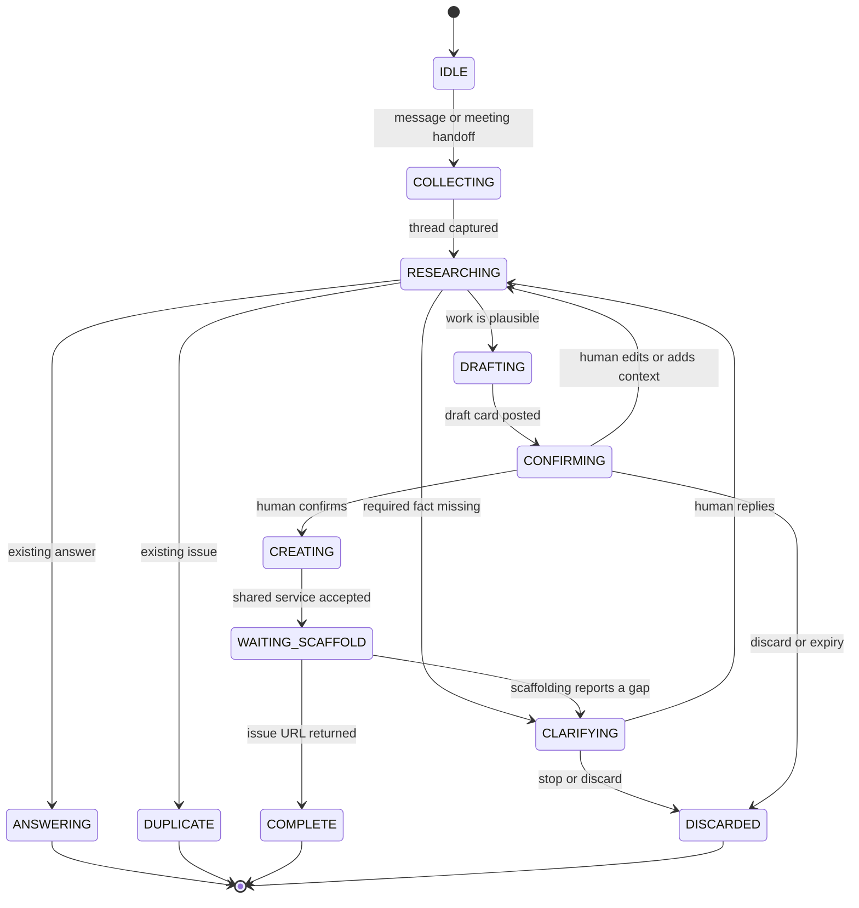

# Conversational ticket-forming Google Chat bot

**Workflow template:** [`workflows/ticket-bot.template.json`](workflows/ticket-bot.template.json)  
**Target team:** Modus Web Components  
**Deployment owner:** human n8n / Google Chat administrator

## Purpose

The ticket bot turns a thought into the smallest useful next step. It is not a
`create issue` command and it does not turn every meeting sentence into a
ticket. It:

1. reads the originating thread;
2. researches the shared repository context;
3. asks focused questions when the context is insufficient;
4. answers or links an existing issue when no new work is needed;
5. shows a human a draft before creating a work item; and
6. sends confirmed work through the shared issue service and Issue Scaffolding
   v2.

The issue remains the audit boundary. The bot does not call Dev or approve
implementation.

## Entry points

The Google Chat app receives `MESSAGE` and interaction events at the n8n
webhook. Supported message forms:

- mention the bot in an existing thread;
- reply to a bot clarification;
- `/ticket` followed by a thought;
- `/ticket stop` or a `Discard` card action;
- a controlled handoff from the Gemini meeting-notes workflow.

The app should not watch every group message by default. A future observation
mode may answer question-shaped messages, but issue creation still requires a
mention and confirmation.

## Conversation state machine



The static state key is the Google Chat thread name, not the display name of a
user. Every state record has an `updatedAt` timestamp and expires after 24
hours unless the human explicitly resumes it.

## Decision policy

The agent must return one of these outcomes:

| Outcome | Bot behavior | Issue created? |
| --- | --- | --- |
| `answer` | Give a cited answer in the thread | No |
| `duplicate` | Link the matching issue and explain the match | No |
| `clarify` | Ask numbered questions in the thread | No |
| `confirm_create` | Show a draft card with Confirm / Edit / Discard | No |
| `create_issue` | Call the shared issue service after a confirmed action | Yes |
| `stop` | Clear state and acknowledge | No |

The agent may not choose `create_issue` from an ordinary `MESSAGE` event. The
event must be a confirmed card action whose state contains the exact draft
shown to the human. A stale or replayed confirmation returns an idempotent
“already processed or expired” response.

## Shared-context research

Research is performed before clarification questions are generated. The
agent's context prompt instructs it to inspect:

1. `src/custom-elements.json` in `trimble-oss/modus-wc-2.0`;
2. `get_modus_component_data` and
   `get_modus_implementation_data` through the component-docs MCP;
3. component readmes and Storybook stories;
4. `AGENTS.md` and applicable `.cursor/rules/*`;
5. `docs/component-graph/component-graph.json`;
6. open and closed GitHub issues and PRs.

Every capability claim must carry a source reference. The agent must say
“not found in the inspected sources” rather than infer that two components
behave the same. If a request is a new API/state, the clarification must ask
for the intended behavior and product decision rather than silently deciding.

For the private pilot, this research is supplied by the dedicated
`context-resolver` n8n sub-workflow before the model answers. Chat text alone
is not repository context. The resolver receives component/property/state
hints and returns exact manifest evidence or `notFound`; that structured result
must be included in the agent prompt.

## Message contract

The normalized input passed to the model is:

```json
{
  "eventType": "MESSAGE",
  "spaceName": "spaces/AAA",
  "threadName": "spaces/AAA/threads/BBB",
  "messageName": "spaces/AAA/messages/CCC",
  "sender": {
    "displayName": "Human",
    "email": "human@trimble.com"
  },
  "text": "Should the select support a read-only state?",
  "threadMessages": [
    {
      "name": "spaces/AAA/messages/...",
      "text": "...",
      "createTime": "2026-09-07T10:00:00Z",
      "sender": "..."
    }
  ],
  "source": {
    "kind": "chat",
    "url": "https://chat.google.com/...",
    "meetingDocId": null
  },
  "state": {}
}
```

The model must return JSON matching this shape:

```json
{
  "outcome": "clarify",
  "summary": "The requested read-only behavior is not yet specified.",
  "questions": [
    "Should read-only select preserve the current selected value while preventing menu interaction?",
    "Which consuming products require this state?"
  ],
  "draft": {
    "title": null,
    "summary": null,
    "type": "feature",
    "components": ["modus-wc-select"],
    "labels": ["needs-scaffolding"],
    "acceptanceCriteria": [],
    "designNeeded": true
  },
  "evidence": [
    {
      "claim": "The inspected source does not list read-only for select.",
      "source": "src/custom-elements.json#/modules/modus-wc-select"
    }
  ],
  "statePatch": {
    "phase": "clarifying",
    "questions": [],
    "draft": null
  }
}
```

The workflow validates `outcome`, limits questions to five per turn, limits
the draft title and summary lengths, and rejects a `create_issue` result unless
the interaction branch has already verified confirmation against static state.

## Clarification rules

The bot asks questions only after checking the repository. Good questions are
decision-shaped:

- “The manifest shows `readOnly` on text input but not on select. Is the
  requested select behavior a new API, or should the design use an existing
  disabled/read-only pattern?”
- “Which states must the design cover: loading, empty, error, disabled,
  keyboard focus, or only the default selected state?”
- “Should this be one paired design/development feature or a documentation
  change to an existing capability?”

Bad questions repeat information already available in the manifest, ask for
implementation details before product intent, or request a user to paste
repository files the bot can inspect itself.

When the user says “stop,” “not now,” or “no issue,” the bot clears the thread
state. When a user says “create it,” the bot still shows the final draft if
the current state is not already `confirming`.

## Draft card

The confirmation card contains:

- title and type;
- problem summary;
- affected components;
- proposed behavior;
- acceptance-criteria sketch;
- design-needed indicator;
- evidence links;
- source thread link;
- `Confirm and create`, `Edit`, and `Discard` actions.

`Edit` returns to `CLARIFYING` and includes the human's edit in the next
research pass. The card must not expose webhook secrets or the full static
state.

## n8n workflow

The sanitized export mirrors the existing release-notes workflow's important
patterns:

- Webhook entry point for the Google Chat app rather than a one-way incoming
  webhook.
- LangChain Agent connected to the Trimble Model Gateway with model
  `gpt-5.4`.
- Code nodes for input normalization, state management, strict JSON parsing,
  and CardsV2 construction.
- `$getWorkflowStaticData('global')` for per-thread state.
- An HTTP Request node for the shared issue service only after confirmation.
- Respond-to-Webhook nodes for immediate Google Chat responses.

The template contains no credentials, hard-coded Chat URLs, GitHub tokens, or
approval proxy keys. Bind these in n8n:

| Placeholder | Required value |
| --- | --- |
| `TRIMBLE_MODEL_GATEWAY_CREDENTIAL` | Trimble Identity credential |
| `GOOGLE_CHAT_APP_SHARED_SECRET` | Secret used to authenticate Chat events |
| `ISSUE_SCAFFOLDING_WEBHOOK_URL` | Existing Issue Scaffolding webhook |
| `ISSUE_SCAFFOLDING_WEBHOOK_TOKEN` | n8n credential/header, not workflow text |
| `MODUS_REPO` | `trimble-oss/modus-wc-2.0` |
| `MODUS_MCP_ENDPOINT` | approved component-docs MCP endpoint |

Google Chat app registration must point message and interaction events to the
production n8n webhook URL. Test in a private space before adding the app to a
team space.

## Issue service payload

The bot calls the shared service with a normalized payload, never with an
unstructured prompt alone:

```json
{
  "repo": "trimble-oss/modus-wc-2.0",
  "title": "Add a documented read-only state for select",
  "summary": "Product and design need a non-editable selected value...",
  "type": "feature",
  "components": ["modus-wc-select"],
  "labels": ["needs-scaffolding", "design-research"],
  "source": {
    "kind": "google-chat",
    "threadName": "spaces/AAA/threads/BBB",
    "url": "https://chat.google.com/...",
    "meetingDocId": null
  },
  "rawConversation": [
    {"sender": "Human", "text": "..."}
  ],
  "contextEvidence": [
    {"claim": "...", "source": "..."}
  ],
  "autoApprove": false
}
```

The service performs duplicate search and sends the accepted request to Issue
Scaffolding. It returns the GitHub issue URL or a structured clarification
response. See [`issue-service.md`](issue-service.md).

## Failure and safety cases

| Case | Required result |
| --- | --- |
| Chat event signature missing/invalid | Reject before model invocation |
| MCP unavailable | Say so, use checked-in sources if available, and lower confidence |
| No component identified | Ask for the product area/component; do not create |
| Existing issue matches | Link it as `duplicate`; do not create |
| Existing answer resolves question | Answer in thread; do not create |
| User confirmation is stale/replayed | No duplicate issue; explain expiry |
| Issue service timeout | Keep `creating` state idempotent and offer retry |
| Scaffolding returns clarification | Relay exact questions and remain open |
| User requests process/meta work | Explain that no repo issue is needed |
| Model returns invalid JSON | Do not create; post a safe retry message |

## Acceptance tests before enabling creation

Run these with issue creation disabled first:

1. Ask a question answered by an existing readme; verify no issue.
2. Ask for a known open issue; verify duplicate linking.
3. Use a short #1466-like capability request; verify a cited clarification
   question before a draft.
4. Confirm a complete feature; verify exactly one request reaches the shared
   service with `autoApprove: false`.
5. Replay the confirmation action; verify no second issue.
6. Send `stop`; verify static state is removed.
7. Force an MCP timeout; verify the bot discloses the gap.
8. Return `## NEED CLARIFICATION` from Issue Scaffolding; verify it is relayed
   to the originating thread.
