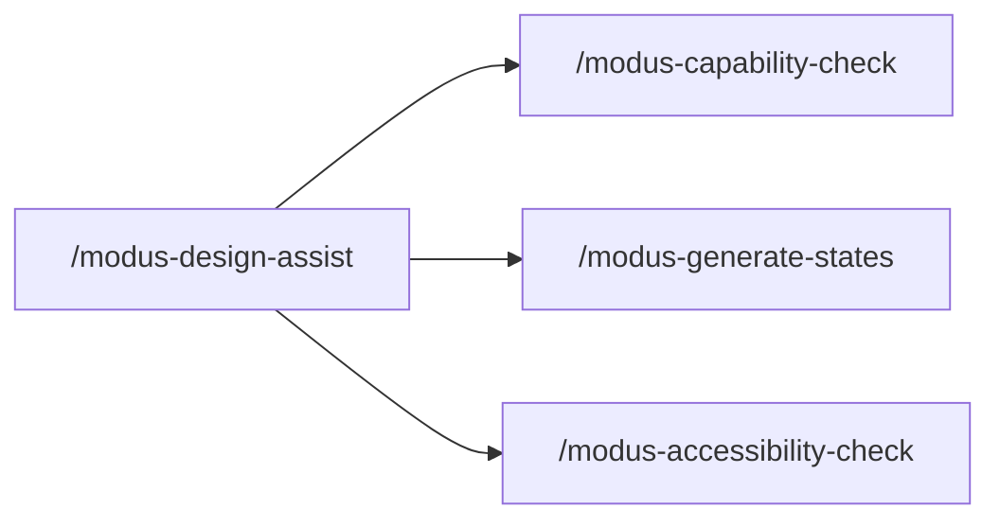

# Figma agent skills (Modus designer copilot)

**Primary surface for designers:** Figma **Agents** panel (left sidebar or select layer → Agents).

Upload each single-file skill: **Agents → Skills → Upload** (or create manually in the chat sidebar).

## Skill suite

| Skill file | Slash command | Use for |
| --- | --- | --- |
| [modus-design-assist.skill.md](./modus-design-assist.skill.md) | `/modus-design-assist` | **Start here.** Intake interview, pattern choice, untagged frames, routes to other skills |
| [modus-capability-check.skill.md](./modus-capability-check.skill.md) | `/modus-capability-check` | Modus API fit, sibling precedent, web standards, new-api-candidate |
| [modus-generate-states.skill.md](./modus-generate-states.skill.md) | `/modus-generate-states` | Missing variants/states with rationale (Focus, Error, Loading, Open…) |
| [modus-accessibility-check.skill.md](./modus-accessibility-check.skill.md) | `/modus-accessibility-check` | ARIA patterns, WCAG, keyboard, focus, contrast |

## What each skill does beyond Modus API lookup

| Need | Skill |
| --- | --- |
| "I have a list — menu or tree?" | `/modus-design-assist` |
| "Does readonly exist on select?" | `/modus-capability-check` + web standards |
| "What states am I missing?" | `/modus-generate-states` |
| "Is this accessible?" | `/modus-accessibility-check` |
| No `modus-wc-*` tag yet | `/modus-design-assist` or `/modus-capability-check` |

All skills instruct the agent to **ask upfront questions**, **use web search** for ARIA/WCAG/MDN when needed, and reply in **designer language** (not schema dumps).

## Pilot demo flows

### Flow A — Primary assist (recommended opener)

1. Select any component (tagged or not).
2. Agents → `/modus-design-assist`
3. Answer intake: building new state / no tag yet / form vs navigation.
4. Agent recommends pattern, Modus sibling, or next skill.

### Flow B — Accessibility (strong demo)

1. Select Dropdown / Select.
2. `/modus-accessibility-check`
3. Ask about **readonly** or **loading**.
4. Agent returns constraints, alternatives, Figma fixes, WCAG links.

### Flow C — Generate states

1. Select component with only Default + Disabled.
2. `/modus-generate-states`
3. Agent lists missing Focus, Error, Loading, Open, Selected with design direction.

### Flow D — Untagged list → pattern choice

1. Select a frame with a list of items (no Modus tag).
2. `/modus-design-assist`
3. Agent asks interaction model → recommends menu vs tree vs listbox + Modus sibling.

## Cursor handoff

| Surface | Role |
| --- | --- |
| **Figma Agents + skills** | Interactive design help in Figma |
| **Cursor `design-capability-check`** | Repo manifest citations, MCP, impact graph, issue drafts |

When the agent needs proof from `custom-elements.json` or GitHub, it should suggest Cursor `design-capability-check`.

Shared pack artifacts live in [../figma-plugin/](../figma-plugin/) (`designer-context.json`, `standards-rules.json`). Figma skills embed key rules inline; the agent uses web search for full ARIA/WCAG coverage.

## Install in Figma

1. Open a design file → **Agents** in left nav.
2. **Skills → Upload** each `.skill.md` file (one file per skill).
3. Invoke with slash commands in the prompt box.

Docs: [Custom skills for the Figma agent](https://help.figma.com/hc/en-us/articles/40283639496599-Custom-skills-for-the-Figma-agent-and-Figma-Make)

## Keyboard shortcut

Figma agent mini-chat: **Cmd/Ctrl+Enter** on a selection. Start with `/modus-design-assist` for the full intake flow.
