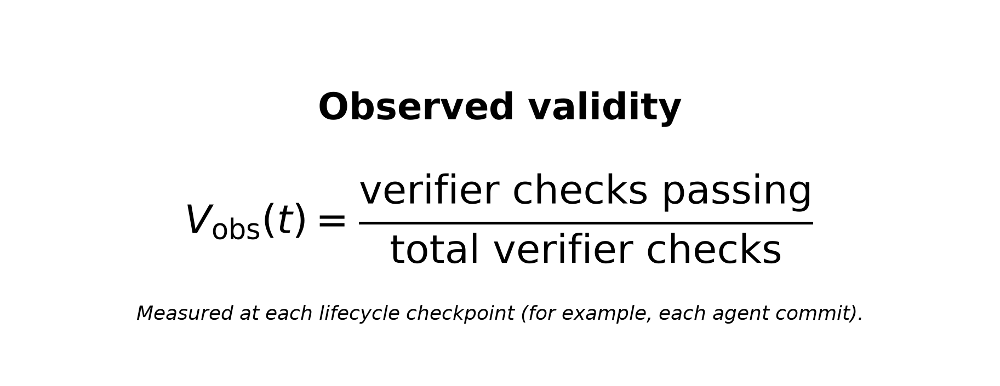
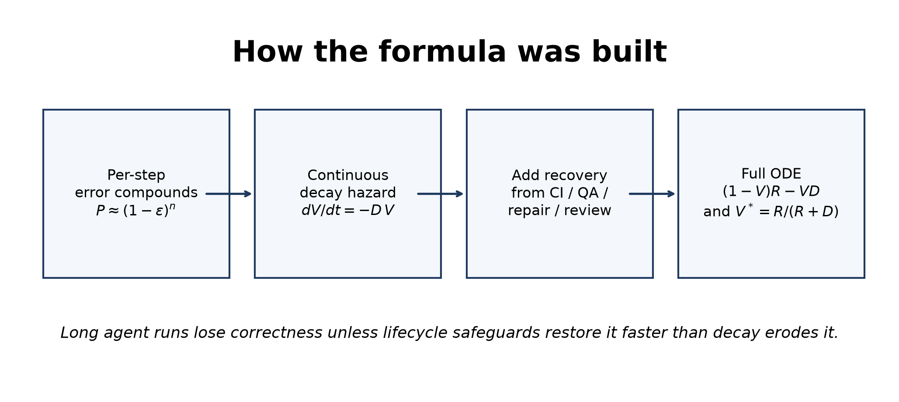
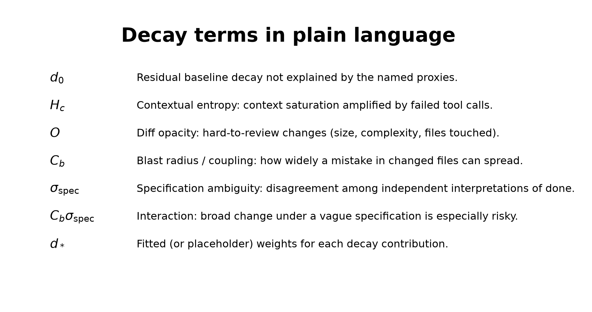
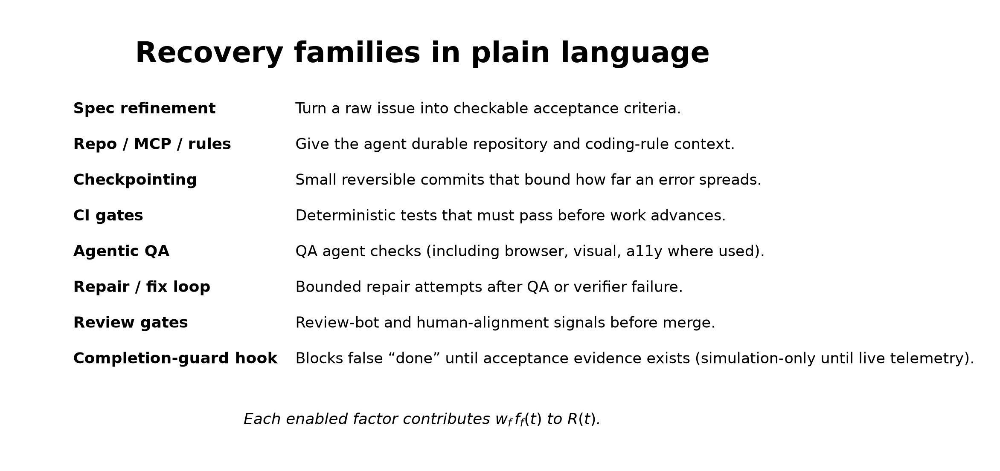

# How the Validity Formula Was Built

This note explains the **AI-Native PDLC Validity Framework** formula in plain language,
with the equation images used in the full TTC abstract.

Weights shown in pilots are **initial / placeholder**, not Modus-fitted factory weights.

---

## 1. Why a formula at all?

Long autonomous agent runs do not fail mainly because a single step is hard. They fail
because small per-step mistakes **compound**. If each step has even a 1% chance of going
wrong, the chance that a 100-step trajectory stays entirely correct is already about
37%; at 300 steps it is about 5%. That compounding-error pattern is why long-horizon
autonomy needs lifecycle safeguards (tests, QA, repair, review), not only a stronger
model.

We needed a number that answers a different question than model benchmarks:

> Does this **setup**—agents, context, CI, QA, repair, and review—restore trust faster
> than the work environment erodes it?

---

## 2. What we measure: observed validity `V(t)`

At each lifecycle checkpoint (for example, each agent commit), we treat validity as the
share of verifier checks that currently pass:

So `V(t)` is a **time series of verified workflow evidence**, not a subjective opinion
about the model. The framework rates the delivery setup from that series.

---

## 3. From compounding error to a decay rate

Model the agent as a sequence of steps. With a roughly constant per-step error rate, the
probability of an entirely correct trajectory falls exponentially with the number of
steps. Taking the continuous-time limit turns that into a **decay hazard** `D(t)`:

- Without safeguards: validity only falls — `dV/dt = −D(t)·V`.
- That is the mathematical form of “long runs drift incorrect unless something catches
  and repairs mistakes.”

---

## 4. Adding recovery: the full ODE

Real setups push back. CI catches regressions, QA rejects broken work, repair loops fix
failures, review gates stop unsafe merges. We model that push-back as a recovery rate
`R(t)` that acts on **invalid** work (capacity `1 − V`), while decay acts on **valid**
work (mass `V`):

Reading it in plain language:

- When work is mostly wrong (`V` low), there is more room for recovery to help.
- When work is mostly right (`V` high), there is more mass that can still decay.
- Raising `R` (better CI, QA, repair, review) pulls trust up.
- Raising `D` (lost context, vague acceptance criteria, hard-to-review diffs, wide
  blast radius) pulls trust down.

---

## 5. Building the decay rate `D(t)`

Many measurable stresses collapse into one decay rate. The v1.1 **default** form is
hybrid: main effects plus one interaction (broad change under a vague specification):

Alternative forms (purely multiplicative or purely additive) exist for model comparison.
Simulation and fitting chose hybrid as the default pending repository-fitted campaign data.

---

## 6. Building the recovery rate `R(t)`

Recovery is **not** a hardcoded three-term expression. It is a **registry sum** over
enabled setup factors. Each factor has activity `f_f(t) ∈ [0, 1]` and a weight `w_f`:

That registry design is why the framework can diagnose a missing control (for example,
a completion-guard hook) instead of only saying “the model failed.”

---

## 7. Equilibrium trust `V*`

When `R` and `D` are roughly steady, validity settles at:

Examples:

- If recovery equals decay (`R = D`), then `V* = 0.5`.
- If recovery is three times decay (`R = 3D`), then `V* = 0.75`.

Simulations set a provisional high trust threshold near **`V* = 0.65`** (placeholder;
updated later from live campaign results). Scores below that threshold mean the setup
is not yet earning the trust level we require before loosening review depth.

---

## 8. How we use the formula in practice

1. Score a run so we get provisional `R`, `D`, and `V*`.
2. Diagnose the weak layer or factor (environment, implement–QA–repair loop, or handoff).
3. Change **one** control.
4. Remeasure.

On **Modus Web Components**, applying the framework to a Cursor Cloud Automations run
showed a skipped acceptance criterion and named the weak recovery sub-factor as the
completion-guard hook. Provisional `V*` moved from below the 0.65 threshold to above
it after adding that hook and re-running. That case is a directional pilot with
placeholder weights, not a fitted factory calibration.
