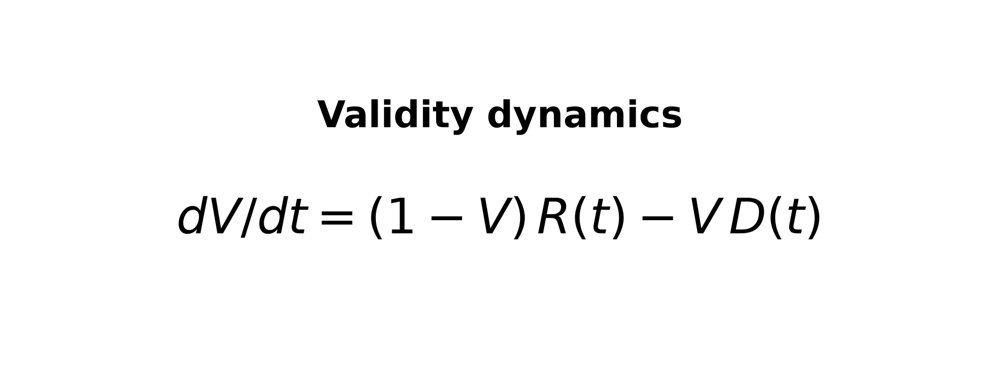
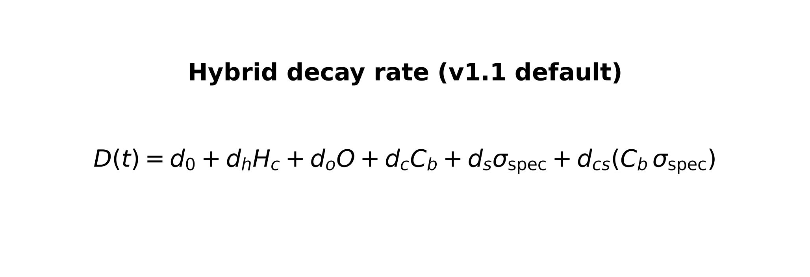
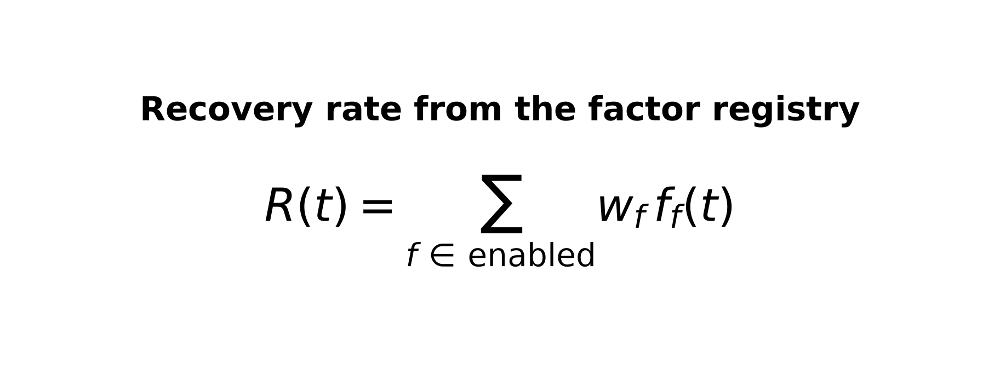
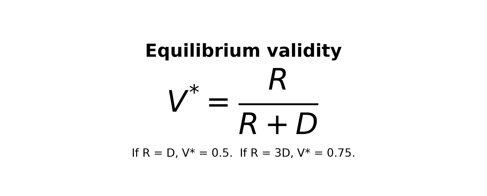

# TTC 2027 Abstract

## Title

**AI-Native PDLC Validity Framework: Measuring Trust in Autonomous Product Delivery**

Elisha Sam Peter Prabhu · Preethi Rangamma

## Abstract

### Strategic Context

Trimble's company-wide [AI PDLC](https://trimble-ai-pdlc.web.app/) [[4](#sources)] is an operating
model that uses AI agents across discovery, planning, implementation, testing, review,
and release to move work from an approved problem toward delivery. It organizes that
work through Discovery (T0), Viability (T1), and Build & Test (T2). Teams are adopting
this path, and it is already helping them produce development output faster. The next
opportunity is converting that added output into dependable delivery and higher merge
throughput.

### Problem: The Review Bottleneck

AI helps teams develop changes faster. Delivery still waits on human review: a change
reaches done only after someone reviews and merges the PR. As ready PR volume grows,
review capacity constrains merge throughput. Recent longitudinal research reports that
AI-authored pull requests take approximately 20% longer from first human review to
merge, even while review depth declines under increased workload [[1](#sources)].

That bottleneck suggested a different operating model: shift scarce developer
attention from code production to the merge decision. Agents implement, test, and
repair; developers approve development-ready issues and review the resulting PRs.

### Solution Part 1: Automate the Delivery Workflow

Under that operating model, we automate the issue-to-PR path while retaining human
review on every finished PR.

A development-ready issue is one whose requirements and acceptance criteria are ready
for implementation. For our automations, we use Cursor Cloud Automations (cloud
agents on GitHub) [[5](#sources)]. A developer starts from a development-ready GitHub
issue, or on an existing issue adds a comment such as `/approve`. Cursor Cloud
Automations pick up that signal, implement the solution, hand the result to a QA
automation agent, and on failure send it to a repair automation agent. Implement, QA,
and repair cycle back and forth until the work is ready, capped at three repair rounds
for this experiment. When ready, the pull request is updated for human review and the
developer reviews it.

That path already spans three engineering layers. The **harness** is the operating
environment: cloud agents, repository context, rules, MCP (Model Context Protocol)
tools, permissions, persistence, and observability [[5](#sources)][[6](#sources)].
The **loop** is the evidence cycle: implement, QA, and repair against acceptance
criteria and tests, with a stop rule based on tests, acceptance criteria, and QA
evidence. The **graph** is the explicit workflow topology: issue approval, handoffs,
retry limits, branches, and the human PR-review gate. GitHub labels and comments make
those transitions both operational events and timestamped measurements. Teams can
build the same operating model with Cursor APIs, custom orchestration, or other agent
tooling; Part 2 rates the complete setup across implementations. Current maturity: a
working pilot on one repository (Modus) plus a simulation-calibrated formula; these
are lessons learned from internal experiments at pilot scale.

AI can still return incorrect work confidently, and the team remains accountable for
what merges. Therefore each handoff must leave concrete evidence—acceptance criteria,
test results, and QA findings—that can be checked before work advances.

> **Cloud-only note:** An ongoing experiment treats a slice of work as fully
> cloud-operational (Cursor Cloud Automations only; no local terminal or local
> development). The iPad surface is intentional: no IDE coding on device, only
> automations and prompts when an experiment needs them, to probe how far teams can
> rely on the setup for certain work and where human review must remain. This
> workstream is independent of the Modus formula experiment.

### Trust Gap After Automation

Concrete evidence makes each handoff checkable, but it does not show whether the
complete workflow repeatedly produces acceptable work. Current benchmarks primarily
score models on fixed tasks [[2](#sources)]; they do not measure the combined effect
of agents, repository context, rules, tests, QA, repair, handoffs, and human gates
over time. Teams therefore need a workflow-level rating that identifies the weak
control and connects evidence and task risk to review depth.

### Solution Part 2: Rate and Improve the Workflow

To answer that need, we treat trust as a changing property of verified workflow
evidence, not as a score for the model alone. A recovery-versus-decay model quantifies
whether controls restore correctness faster than context loss, ambiguity, and change
risk erode it. Official platforms already provide primitives for agent operation,
evidence loops, workflow routing, and risk-based review
[[5](#sources)][[7](#sources)][[8](#sources)][[9](#sources)]. The model evaluates the
complete delivery setup so a team can see which layer owns a reliability weakness.

#### Mathematical Framework for Agent Validity

The dynamical validity model separates the forces that restore trust from those that
erode it during an autonomous run:

System validity `V(t)` is the verified proportion of task requirements satisfied at
a lifecycle checkpoint. There is one aggregate decay rate `D(t)` and one aggregate
recovery rate `R(t)`. Many measured inputs collapse into those two rates at each
checkpoint:

`D(t)` is assembled from multiple measurable causes: contextual entropy `Hc` from
context saturation and failed tool calls; diff opacity `O` from changed lines,
complexity, and files touched; blast radius `Cb` from the share of repository
dependents exposed by a change; specification ambiguity `σspec` from disagreement
among independent interpretations; and an interaction capturing the extra risk of a
broad change under a vague specification. The baseline `d0` represents residual decay
not explained by these inputs; the other `d` coefficients are fitted weights giving
each cause its measured contribution.

`R(t)` sums enabled safeguards, each represented by its current activity `f_f(t)` and
fitted contribution `w_f`. Recovery factors include specification refinement; MCP and
repository context; checkpointing; deterministic CI; browser-based, visual, and
accessibility QA; repair loops; and review gates. Increasing `D` while holding `R`
fixed makes validity fall faster and lowers equilibrium validity. Increasing `R` while
holding `D` fixed detects, constrains, or repairs invalid work faster and raises
equilibrium validity.

The derivation starts with the compounding-error property of multi-step agents: if
each step has a small probability of failure, the probability of an entirely correct
trajectory declines exponentially with the number of steps. Taking the continuous-time
limit produces a decay rate. Adding recovery for errors caught and repaired by
lifecycle safeguards produces the equation above.

At equilibrium, validity settles at the steady value when recovery and decay
balance:

The **AI-Native PDLC Validity Framework** turns this measurement into periodic
diagnosis: locate the weak operating environment, repair cycle, or handoff; change
one control; measure again; then set review depth from evidence and task risk. Full
factor definitions and the derivation story are in
[formula-explained.md](formula-explained.md).

With the metric now defined, simulations set a provisional trust threshold of
`V* = 0.65`. The pilot's provisional research score, calculated with placeholder
rather than repository-fitted weights, moved R 0.20→0.30, D 0.1562→0.1066, and
V\* 0.5615→0.7377 (below then above that threshold). The framework maps the skipped
acceptance criterion to the weak recovery sub-factor `completion_guard_hook` in the
**loop** layer; Level 2 harness calibration and factory weights remain future work.

Here, R is recovery strength and D is task decay pressure. The implication is
practical: to maintain a target level of trust, the strictness of the surrounding
PDLC controls must scale with the complexity and risk of the work. If `R = D`,
equilibrium validity is 0.5; if recovery (QA, repair, gates) is three times decay, it
is 0.75. If recovery is weak relative to decay (context loss, blast radius,
ambiguity), equilibrium stays low even when agents look productive. The model rates
that balance for the setup; it is a periodic setup rating, not a score on every pull
request. Exact numerical effects require repository-specific fitted weights;
simulation-calibrated weights provide a provisional directional signal. Completed
simulations tested this two-rate structure before its application to Modus.

Structural simulations test whether changing recovery or decay moves outcomes as the
two-rate model predicts; the live Modus retest tests whether its diagnosis produces
operational recovery. Together, these evidence streams test the framework's structure
and its use in a live workflow. Deep review stays on major or
high-risk work, high-level review covers trusted work, and small low-risk work can
receive minimal but nonzero review. Human review is never removed. Cursor
documentation permits automatic approval for qualifying low-risk PRs [[7](#sources)];
this proposal keeps a stricter policy of minimal but nonzero human review on every PR.

### Applying the Framework

We applied the framework to Modus Web Components, Trimble's open-source UI component
library, using development-ready issues with pinned acceptance criteria at low,
medium, and high complexity. Low-complexity work passed reliably; harder work exposed
weak controls. In a medium autocomplete task, the agent implemented filtering and
selection, then regressed Escape-and-focus behavior while debugging screen-reader
wiring and still reported completion. Browser QA caught the pinned criterion late.
The first console run skipped an acceptance criterion and claimed done without the
required evidence checks. The framework located the weak recovery sub-factor as
`completion_guard_hook`. After adding the completion-guard hook, a comparable run
enforced acceptance checks, failed QA once, entered repair, and passed the next QA
round. Provisional `V*` moved from below the 0.65 threshold to above it; the stronger
live result is this observed recovery. Inspect the path at
[Trimble Cursor Automations](https://cursor.com/t/trimble/automations).

**Intervention.** Applying the formula to the Issue above showed recovery was too late
and incomplete at the stop boundary: the agent could say "done" without acceptance
criteria, test results, and QA evidence present. The model pointed at a missing
earlier control. We encoded that control as a completion-guard hook (and as rules or
skills for how agents run): block "done" until that evidence is present, then force
one repair.

Before testing the hook, we wrote down predictions: near-zero gain on the full
pipeline, positive gain where automated QA is absent. Measured on high-complexity
tasks without automated QA, the share of tasks correct on the first delivery rose by
about +2 to +17 percentage points and mean validity by about +0.003 to +0.022 across
a detection-rate sweep; on the full pipeline the gain was near zero, matching the
ceiling prediction. Direction matched the forecast, validity gains were smaller than
predicted, and first-delivery correctness carried the clearer signal. Measured in
hook-on versus hook-off simulations. Matching the predictions is evidence the model
describes the setup correctly.

**Live console retest.** Separately from the hook simulations, the Modus run above
tested the diagnose / one-intervention / retest sequence in operation. Simulation and
console evidence answer different questions: the simulations test the model's
structure, while the live retest shows that applying its diagnosis restored the
missing repair path on comparable medium work.

> **Note:** The framework is the formula plus packaged guides, skills, and rules that
> turn experiment values into setup changes. We used it to improve Modus automation;
> other teams can do the same on their setups. The framework is for periodic diagnose
> and improve; it is not part of the every-PR path. That path remains implement, QA,
> repair, and human review.

### What Teams Get

**Part 1** automates the issue-to-PR path through harness, loop, and graph controls so
developer cognitive attention can focus on review and merge metrics can rise.
**Part 2** adds the trust metric: recovery versus decay lets a team define its current
state of quality, improve the weak layer in the setup, and then scale review depth
with measured trust and task risk. Human review remains; deep review stays on major or
high-risk work, high-level review covers trusted work, and small low-risk work can
receive minimal but nonzero review. The intended payoff is higher merge throughput
once review depth follows measured trust and task risk, building on the speed gains AI
PDLC already provides.

Adoption is periodic calibration of the setup. **Level 0, Observe:** compute a
provisional setup signal from existing CI, diff, and event data. **Level 1,
Instrument:** capture lifecycle handoffs, verifier outcomes, repair attempts, and
review burden. **Level 2, Calibrate and improve:** run representative baseline and
factor-off tasks, fit repository-specific contributions, identify weak factors, change
the setup, and remeasure. Install the research-preview CLI with
`pip install pdlc-validity` (https://pypi.org/project/pdlc-validity/). Schemas,
Cursor skills, and intervention templates live at
https://github.com/ElishaSamPeterPrabhu/ai-native-pdlc-validity-framework so teams can
inspect measurement gaps and apply approved rules, hooks, or workflows; it does
not ship Modus-fitted factory weights until the live campaign completes.

### What we will show

We will sequence the demo to match the paper's spine. First, Part 1 live: create or
`/approve` a development-ready issue, watch Dev / QA / Fix agents hand off through
GitHub labels, and show the finished PR entering human review. Second, the trust
failure: walk through the medium-complexity autocomplete false-completion case
(Escape-and-focus regression reported as done, QA catch late) and why a finished PR
still needs a trust signal before review depth can change. Third, Part 2: how
recovery-versus-decay experiments produced the Validity Framework, the
simulation-tested completion guard, and the live before/after retest from an open
cycle to a completed QA-and-repair cycle. Show how risk-scaled review follows from
measured trust. Inspect the automations at
[Trimble Cursor Automations](https://cursor.com/t/trimble/automations) under author
**Elisha Sam Peter Prabhu** (**Dev Agent**, **QA Agent**, **Fix Agent**), so peers
can instrument a similar path with Cursor Cloud Automations, Cursor APIs, or other
agent tooling.

**Key takeaways for the audience:**

1. **Part 1: Automate issue-to-PR work so attention can focus on review.** Agents run
   implement, QA, and repair through harness, loop, and graph controls; humans review
   finished PRs before merge. The purpose is a stronger PDLC with higher merge metrics.
   Cursor Cloud Automations power our automations; teams can use Cursor
   APIs, custom orchestration, or other agent tooling.
2. **Part 2: Measure trust and fix the exact gaps.** Experiments on the
   recovery-versus-decay model produced the Validity Framework, which supplies the
   trust metric for AI-authored delivery and points at which layer is weak. It ships
   as packaged guides, skills, and rules. Everything measurable collapses into one
   recovery rate `R(t)` and one decay rate `D(t)`; trust holds when recovery outweighs
   decay. Simulations set the trust threshold; applying the framework on live Modus
   Automations then closed the implement–QA–repair loop on a second medium PR after
   adding the completion-guard hook for skipped acceptance criteria.
3. **Scale review depth with measured trust and risk.** Testing by task difficulty
   (low, medium, and high complexity) shows where the setup already earns confidence.
   Keep deep human review on major or high-risk work, use high-level review where
   trust holds, and allow minimal but nonzero review on small low-risk work. The
   intended outcome is higher merge throughput with human review retained.

## Sources

1. *AI Writes Faster Than Humans Can Review: A Longitudinal Study of an Enterprise
   “2×” Mandate*, arXiv:2607.01904, 2026. Reports approximately 20% longer time from
   first human review to merge for comparable AI-authored pull requests.
2. METR, *Measuring AI Ability to Complete Long Tasks*, arXiv:2503.14499, 2025.
   Basis for task-complexity stratification and the compounding-error motivation.
3. Sierra Research, *τ-bench: A Benchmark for Tool-Agent-User Interaction in
   Real-World Domains*, arXiv:2406.12045, 2024. Source of the pass-to-the-k
   consistency measure used in the extended methodology.
4. Trimble AI PDLC, https://trimble-ai-pdlc.web.app/. Company-wide initiative for
   AI-assisted delivery across the Product Development Lifecycle.
5. Cursor, Cloud Agents and Automations, https://cursor.com/docs/cloud-agent and
   https://cursor.com/docs/cloud-agent/automations. Official primitives for
   cloud-agent execution, triggers, tools, repository scope, and MCP.
6. Cursor, MCP and Cloud Agent best practices,
   https://cursor.com/docs/mcp and
   https://cursor.com/docs/cloud-agent/best-practices. Official guidance on tools,
   rules, and external context for agent operation.
7. Cursor, PR Routing & Approval, Agent Review, and Bugbot,
   https://cursor.com/docs/approval-agents,
   https://cursor.com/docs/agent/agent-review, and https://cursor.com/docs/bugbot.
   Official risk scoring, reviewer routing, review depth, automated findings, and
   approval controls.
8. LangChain, LangGraph Graph API,
   https://docs.langchain.com/oss/python/langgraph/graph-api. Official documentation
   for state, nodes, edges, conditional routing, and persistence in agent workflows.
9. OpenAI, Agents SDK orchestration and guardrails,
   https://openai.github.io/openai-agents-python/multi_agent/ and
   https://openai.github.io/openai-agents-python/guardrails/. Official documentation
   for handoffs, execution flow, and validation boundaries.
10. AI-Native PDLC Validity Framework,
    https://github.com/ElishaSamPeterPrabhu/ai-native-pdlc-validity-framework and
    https://pypi.org/project/pdlc-validity/. Research-preview CLI, schemas, and full
    abstract.
